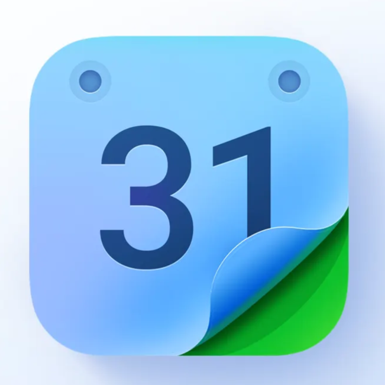

<p align="center">
  
</p>

<h1 align="center">Chronos</h1>

<p align="center">
  <strong>A Modern Family Calendar & Event Management App</strong>
</p>

<p align="center">
  <a href="#features">Features</a> •
  <a href="#screenshots">Screenshots</a> •
  <a href="#installation">Installation</a> •
  <a href="#tech-stack">Tech Stack</a> •
  <a href="#project-structure">Project Structure</a> •
  <a href="#contributing">Contributing</a> •
  <a href="#license">License</a>
</p>

<p align="center">
  
  
  
  
  
</p>

---

## Overview

**Chronos** is a beautifully designed, fully functional family calendar and event management application built with React Native and Expo. It helps families stay organized by providing an intuitive interface for scheduling events, managing family members, and keeping everyone in sync.

The app features a modern UI with smooth animations, multiple calendar views (Year, Month, Week, Day, Schedule), local data persistence, and a complete authentication flow with onboarding.

## Features

### Calendar & Events
- **Multiple Calendar Views** - Year, Month, Week, Day, and Schedule views similar to Google Calendar
- **Event Management** - Create, edit, and delete events with full details
- **Color-Coded Events** - Categorize events with different colors (Red, Blue, Green, Purple)
- **Event Reminders** - Set multiple reminders for events
- **Recurring Events** - Support for daily, weekly, monthly, and yearly recurrence
- **Location Support** - Add locations to your events

### User Experience
- **Video Splash Screen** - Engaging video intro for first-time users
- **Onboarding Flow** - Beautiful onboarding slides to introduce the app
- **Profile Management** - Complete user profile with avatar, bio, and contact info
- **Avatar Upload** - Take photos or choose from gallery for profile picture
- **Dark/Light Mode** - Automatic theme based on system preference

### Data & Storage
- **Local Persistence** - All data stored locally using AsyncStorage
- **Offline First** - Works completely offline without a backend
- **Profile Sync** - User preferences persist across app sessions

### Premium Features
- **Subscription Plans** - Premium upgrade options (UI ready)
- **Payment Integration** - Checkout flow with multiple payment methods
- **Group Members** - Family member management

## Tech Stack

| Category | Technology |
|----------|------------|
| **Framework** | [React Native](https://reactnative.dev/) 0.81.5 |
| **Platform** | [Expo](https://expo.dev/) SDK 54 |
| **Navigation** | [Expo Router](https://expo.github.io/router/) 6.0 |
| **Styling** | [NativeWind](https://www.nativewind.dev/) (Tailwind CSS) |
| **UI Components** | [React Native Reusables](https://reactnativereusables.com) |
| **State Management** | React Context API |
| **Storage** | [@react-native-async-storage/async-storage](https://react-native-async-storage.github.io/async-storage/) |
| **Date Handling** | [date-fns](https://date-fns.org/) |
| **Icons** | [Lucide React Native](https://lucide.dev/) |
| **Video** | [Expo AV](https://docs.expo.dev/versions/latest/sdk/av/) |
| **Image Picker** | [Expo Image Picker](https://docs.expo.dev/versions/latest/sdk/imagepicker/) |
| **Notifications** | [React Native Toast Message](https://github.com/calintamas/react-native-toast-message) |
| **Forms** | [React Hook Form](https://react-hook-form.com/) + [Zod](https://zod.dev/) |

## Project Structure

```
chronos/
├── app/                          # Expo Router pages
│   ├── (auth)/                   # Authentication screens
│   │   ├── login.tsx
│   │   ├── signup.tsx
│   │   ├── forgot-password.tsx
│   │   ├── reset-password.tsx
│   │   ├── verify-otp.tsx
│   │   └── change-password.tsx
│   ├── (onboarding)/             # Onboarding flow
│   │   └── welcome.tsx
│   ├── (tabs)/                   # Main tab navigation
│   │   ├── index.tsx             # Home/Calendar screen
│   │   ├── profile.tsx           # Profile screen
│   │   └── create.tsx            # Create event tab
│   ├── (stacks)/                 # Stack screens
│   │   ├── create-event.tsx
│   │   ├── edit-event.tsx
│   │   ├── edit-profile.tsx
│   │   ├── schedule/[date].tsx   # Daily schedule
│   │   ├── notifications.tsx
│   │   ├── payment.tsx
│   │   ├── checkout.tsx
│   │   └── ...
│   ├── _layout.tsx               # Root layout
│   └── index.tsx                 # Entry point
├── assets/
│   ├── images/                   # Static images & SVGs
│   └── videos/                   # Splash video
├── components/
│   ├── ui/                       # Reusable UI components
│   ├── VideoSplash.tsx           # Video splash screen
│   └── ...
├── context/
│   ├── AuthContext.tsx           # Authentication state
│   ├── UserContext.tsx           # User profile state
│   └── EventsContext.tsx         # Events/calendar state
├── lib/
│   ├── constants/                # App constants
│   ├── theme.ts                  # Theme configuration
│   ├── toast-config.tsx          # Toast notifications config
│   └── utils.ts                  # Utility functions
├── app.json                      # Expo configuration
├── tailwind.config.js            # Tailwind CSS configuration
└── package.json
```

## Installation

### Prerequisites

- [Node.js](https://nodejs.org/) (v18 or newer)
- [npm](https://www.npmjs.com/), [yarn](https://yarnpkg.com/), or [pnpm](https://pnpm.io/)
- [Expo CLI](https://docs.expo.dev/get-started/installation/)
- [Expo Go](https://expo.dev/go) app on your device (for testing)

### Setup

1. **Clone the repository**
   ```bash
   git clone https://github.com/rafiferdos/chronos.git
   cd chronos
   ```

2. **Install dependencies**
   ```bash
   npm install
   # or
   yarn install
   # or
   pnpm install
   ```

3. **Start the development server**
   ```bash
   npm run dev
   # or
   yarn dev
   # or
   pnpm dev
   ```

4. **Run on device/emulator**
   - Press `i` for iOS Simulator (Mac only)
   - Press `a` for Android Emulator
   - Press `w` for Web browser
   - Scan QR code with Expo Go app

### Available Scripts

| Script | Description |
|--------|-------------|
| `npm run start` | Start Expo development server |
| `npm run dev` | Start with cache cleared |
| `npm run android` | Run on Android emulator |
| `npm run ios` | Run on iOS simulator |
| `npm run web` | Run in web browser |
| `npm run clean` | Remove .expo and node_modules |

## Configuration

### Environment Setup

The app works out of the box with local storage. No environment variables are required for basic functionality.

### Customization

- **Theme Colors**: Edit `lib/theme.ts` and `tailwind.config.js`
- **Onboarding Slides**: Modify `lib/constants/onboarding.ts`
- **App Name/Icon**: Update `app.json`

## App Flow

```
┌─────────────────┐
│   App Launch    │
└────────┬────────┘
         │
         ▼
┌─────────────────┐     ┌─────────────────┐
│  First Time?    │────▶│  Video Splash   │
└────────┬────────┘ Yes └────────┬────────┘
         │ No                    │
         │                       ▼
         │              ┌─────────────────┐
         │              │   Onboarding    │
         │              └────────┬────────┘
         │                       │
         ▼                       ▼
┌─────────────────┐     ┌─────────────────┐
│  Logged In?     │◀────│     Login       │
└────────┬────────┘     └─────────────────┘
         │ Yes
         ▼
┌─────────────────┐
│   Home Screen   │
│   (Calendar)    │
└─────────────────┘
```

## Contributing

Contributions are welcome! Please feel free to submit a Pull Request.

1. Fork the repository
2. Create your feature branch (`git checkout -b feature/AmazingFeature`)
3. Commit your changes (`git commit -m 'Add some AmazingFeature'`)
4. Push to the branch (`git push origin feature/AmazingFeature`)
5. Open a Pull Request

### Development Guidelines

- Follow the existing code style
- Use TypeScript for type safety
- Write meaningful commit messages
- Test on both iOS and Android before submitting

## Roadmap

- [ ] Push notifications for event reminders
- [ ] Cloud sync with backend API
- [ ] Family sharing & real-time collaboration
- [ ] Widget support (iOS/Android)
- [ ] Calendar integrations (Google, Apple, Outlook)
- [ ] Voice assistant integration

## License

This project is licensed under the MIT License - see the [LICENSE](LICENSE) file for details.

## Acknowledgments

- [React Native Reusables](https://reactnativereusables.com) for the beautiful UI components
- [Expo](https://expo.dev/) for the amazing development platform
- [NativeWind](https://www.nativewind.dev/) for Tailwind CSS support
- [Lucide](https://lucide.dev/) for the icon library

---

<p align="center">
  Made with ❤️ by <a href="https://github.com/rafiferdos">rafiferdos</a>
</p>

<p align="center">
  <a href="https://github.com/rafiferdos/chronos/issues">Report Bug</a> •
  <a href="https://github.com/rafiferdos/chronos/issues">Request Feature</a>
</p>
